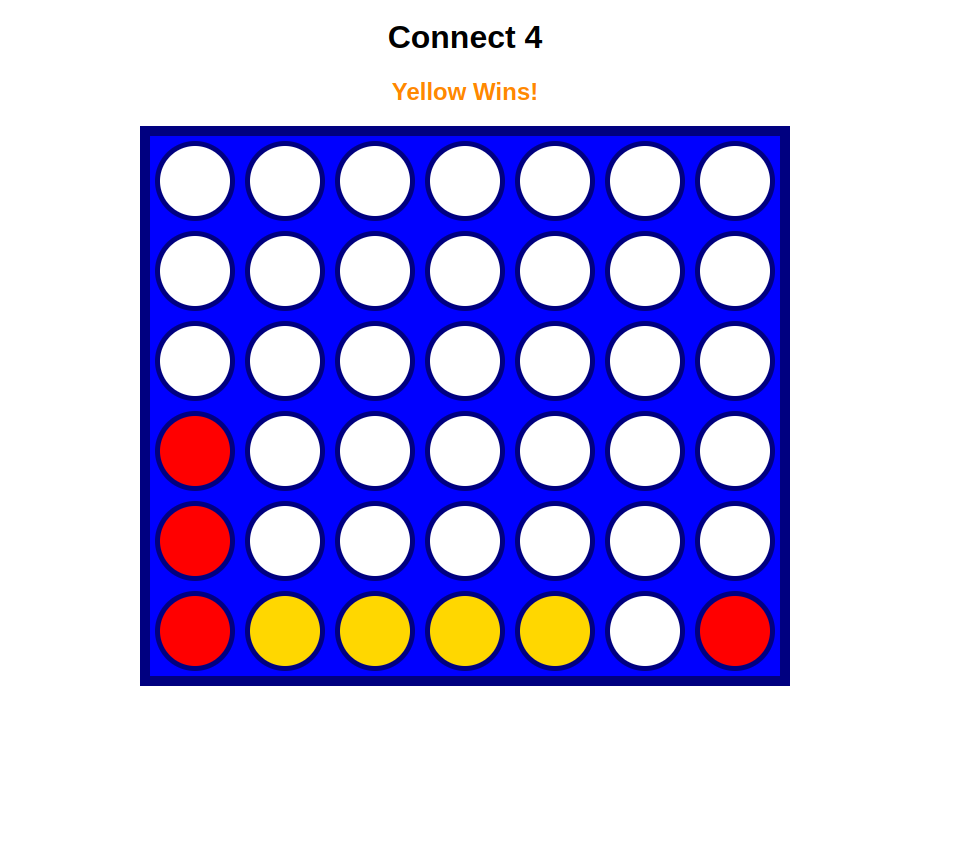

# connect-four

- Connect Four is played on a grid, 7 wide by 6 deep, with two players, 1 (red) and 2 (blue). The players alternate turns, dropping a piece of their color in the top of a column. The piece will fall down to the further-down unoccupied slot.

- The game is won when a player makes four in a row (horizontally, vertically, or diagonally and anti-diagonally). The game is a tie if the entire board fills up without a winner.

## Built With

- HTML5 & CSS
- Git and Git-Flow
- Linters
- JavaScript
- Best

## Live Demo

[Live Demo](https://connect-44.netlify.app/)

## Displays
#### Vertically

#### Horizontally

#### Diagonally

#### Anti-Diagonally

## Authors

👤 **Have-Samuel**

- GitHub: [Have](https://github.com/Have-Samuel)
- Twitter: [samie@1](https://twitter.com/samhave1)
- LinkedIn: [Have](https://www.linkedin.com/in/have-samuel/)

## 🤝 Contributing

Contributions, issues, and feature requests are welcome!

Feel free to check the [issues page](https://github.com/Have-Samuel/connect-fourTrl/issues).

## Show your support

Give a ⭐️ if you like this project!
## 📝 License

This project is [MIT](./MIT.md) licensed.